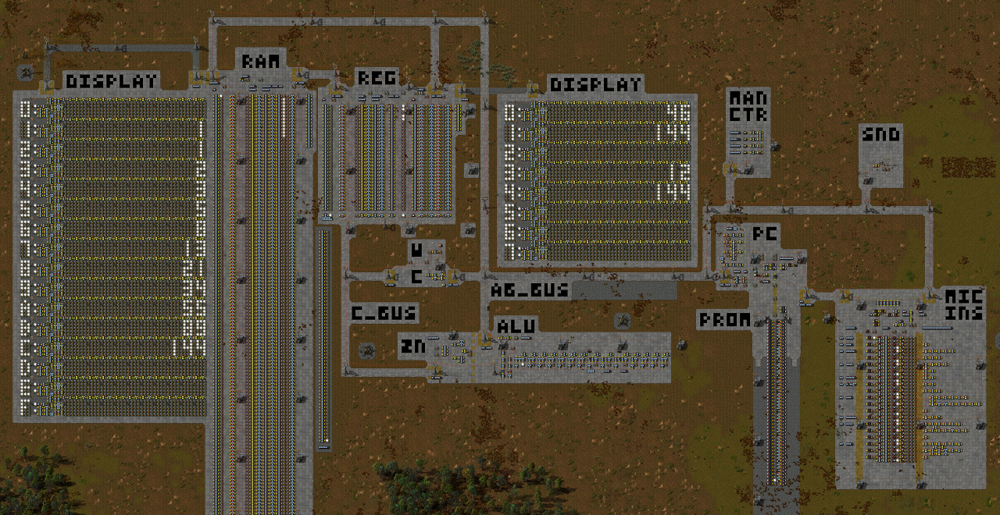

# factorio-computer



A programmable general-purpose computer built in Factorio. It comes with 32 general purpose registers, expandable RAM, and a separate memory for the program.

## Importing the computer to Factorio

The savefile for the computer is included under the FactorioSave folder, titled `Computer.zip`. It can also be imported as a blueprint, see the text file `full_computer.txt` under Blueprints.

### Mods

While no mod is required for the functionality, [Pushbutton](https://mods.factorio.com/mods/justarandomgeek/pushbutton) is of great help when debugging. It also lets you toggle regular constant combinators on or off without using the menu.

## Programming the computer

### By using a symbolic language

See [the assembly quickstart guide](Docs/AssemblyQuickstart.md) for a quick reference on the language.

This repo comes with its own assembly language. It requires Python 3, and any file can be compiled by running
```
python assembly.py
```
from a terminal while within the "Assembly" directory. The default input file is `input.fal`, which can be edited with any text editing software. Any syntax errors are shown in terminal output. The output is saved as `output.fal`, and also copied to the clipboard (on Windows).

### By hand

Adventurous people can attempt to program the computer from within Factorio, instruction by instruction. A full overview of the ISA level signal encoding for each instruction can be found in the link below.

[Opcode machine encodings](Docs/OpcodeMachineEncodings.md)

## Starting the computer

With a new program freshly installed / programmed, you can start the computer by going to the MAN CTR (manual control) module, and turning the constant combinator labelled "START" on or off. The program counter will jump to address 0, and the computer will begin reading the program from PROM and executing each instruction.

